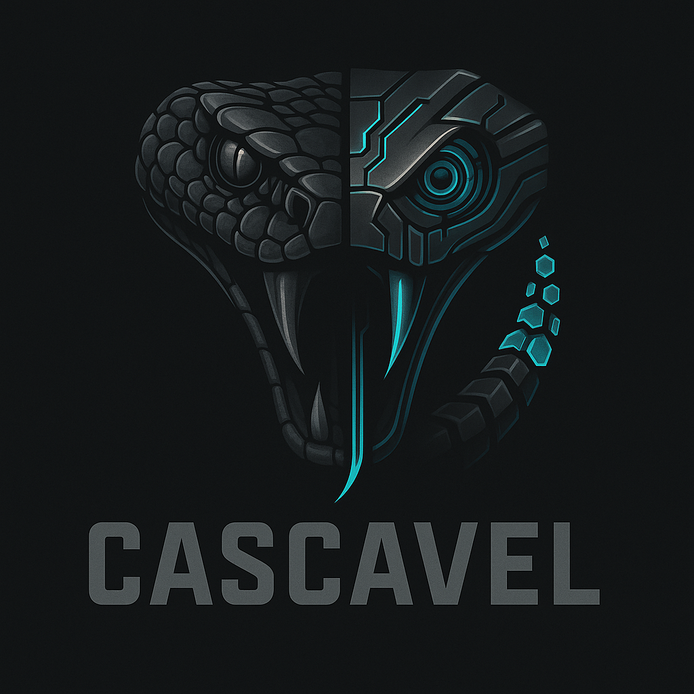

# 🛡️ Cascavel - Quantum Security Framework



[](LICENSE)
[](https://www.python.org/)
[]

## 📝 Visão Geral

O **Cascavel** é um **Quantum Security Framework** modular, extensível e multiplataforma (Linux/macOS) projetado para automatizar e otimizar processos de testes de penetração (pentest). Ele integra ferramentas de segurança líderes de mercado com um sistema robusto de plugins customizáveis, permitindo varreduras abrangentes de subdomínios, portas, diretórios, banners, e a identificação de vulnerabilidades. Além disso, o framework gera relatórios detalhados em Markdown, facilitando a análise e o compartilhamento dos resultados de segurança.

Desenvolvido com foco em escalabilidade e facilidade de uso, o Cascavel visa capacitar profissionais de segurança e equipes de Red Team a realizar avaliações de segurança de forma mais eficiente e completa.

Desenvolvido por [DevFerreiraG](https://github.com/futurodevjunior).

## ✨ Funcionalidades Destacadas

-   **Automação de Pentest Inteligente**: Automatiza tarefas repetitivas e complexas, permitindo que os analistas se concentrem na análise crítica e na exploração manual.
-   **Arquitetura Plugável e Extensível**: Facilmente extensível com novos plugins desenvolvidos pela comunidade ou personalizados para necessidades específicas, cobrindo diversas áreas como segurança de rede, web, nuvem, e wireless.
-   **Multi-Plataforma**: Compatibilidade total com sistemas operacionais Unix-like, incluindo macOS e Linux, garantindo flexibilidade no ambiente de trabalho.
-   **Integração de Ferramentas Essenciais**: Utiliza e orquestra ferramentas de segurança populares como Subfinder, Amass, Httpx, Nmap, Ffuf, Gobuster, Naabu, Nuclei, Feroxbuster e Curl para uma cobertura abrangente de testes.
-   **Gerenciamento de Wordlists Integrado**: Suporte para o uso de wordlists locais e a capacidade de baixar wordlists comuns automaticamente, otimizando ataques de força bruta e enumeração.
-   **Geração de Relatórios Detalhados**: Produz relatórios claros e organizados em formato Markdown, incluindo todas as saídas das ferramentas, banners coletados, resultados de plugins e dados de portas abertas, facilitando a documentação e o compartilhamento.
-   **Criação Automática de Estrutura**: Configura automaticamente as pastas necessárias para exports, relatórios, plugins, wordlists e templates do Nuclei na primeira execução.

## 🚀 Instalação

Para configurar e começar a usar o Cascavel em seu ambiente, siga os passos abaixo:

### ⚙️ Pré-requisitos

Certifique-se de ter o Python **3.8 ou superior** instalado em seu sistema.

### 1. Clonar o Repositório

```bash
git clone https://github.com/FuturoDevJunior/Cascavel.git
cd Cascavel
```

### 2. Criar e Ativar o Ambiente Virtual (Altamente Recomendado)

É uma boa prática isolar as dependências do projeto em um ambiente virtual.

```bash
python3 -m venv venv
source venv/bin/activate  # No Windows, use `venv\Scripts\activate`
```

### 3. Instalar Dependências Python

Instale todas as bibliotecas Python necessárias listadas no arquivo `requirements.txt`:

```bash
pip install -r requirements.txt
```

### 4. Instalar Ferramentas Externas (Opcional, mas Essencial para Funcionalidade Completa)

O Cascavel integra-se com diversas ferramentas externas para oferecer sua funcionalidade completa. Recomenda-se instalar as seguintes ferramentas e adicioná-las ao seu `$PATH`:

-   **Subfinder**: Para enumeração rápida de subdomínios.
    `go install -v github.com/projectdiscovery/subfinder/v2/cmd/subfinder@latest`
-   **Amass**: Para mapeamento avançado da superfície de ataque e descoberta de ativos.
    `go install -v github.com/owasp-amass/amass/v3/...@master`
-   **Httpx**: Para sondagem rápida e análise de servidores HTTP/S.
    `go install -v github.com/projectdiscovery/httpx/cmd/httpx@latest`
-   **Nmap**: Para varredura de portas, descoberta de serviços e detecção de SO.
    *   Linux (Debian/Ubuntu):
        `sudo apt-get install nmap`
    *   macOS (Homebrew):
        `brew install nmap`
-   **Ffuf**: Para fuzzing rápido e robusto de caminhos e parâmetros web.
    `go install -v github.com/ffuf/ffuf@latest`
-   **Gobuster**: Para bruteforce de diretórios, arquivos, DNS e S3.
    `go install github.com/OJ/gobuster/v3@latest`
-   **Naabu**: Para varredura de portas ultrarrápida.
    `go install -v github.com/projectdiscovery/naabu/v2/cmd/naabu@latest`
-   **Nuclei**: Para testes de vulnerabilidade rápidos e baseados em templates.
    `go install -v github.com/projectdiscovery/nuclei/v2/cmd/nuclei@latest`
-   **Feroxbuster**: Para descoberta de conteúdo web via força bruta de diretórios e arquivos.
    `cargo install feroxbuster` (requer [Rust](https://www.rust-lang.org/tools/install))

**Configuração do `$PATH` para Ferramentas Go:**
Se você instalou ferramentas Go, certifique-se de que o diretório `$(go env GOPATH)/bin` esteja no seu `$PATH`. Adicione a seguinte linha ao seu arquivo de perfil do shell (`.bashrc`, `.zshrc`, etc.) e recarregue-o:
`export PATH=$PATH:$(go env GOPATH)/bin`

## 💡 Uso

Após a instalação e configuração das dependências, você pode iniciar o Framework Cascavel executando o script principal:

```bash
./cascavel.py
```

O framework é interativo e solicitará o alvo (IP ou domínio) para iniciar as varreduras e testes:

```
Target (IP/domain): exemplo.com
```

### Fluxo de Execução Simplificado

O Cascavel automatiza uma série de etapas de reconhecimento e testes, incluindo:

1.  **Enumeração de Subdomínios**: Utiliza Subfinder e Amass.
2.  **Sondagem HTTP/S**: Com Httpx e Curl.
3.  **Varredura de Portas**: Com Naabu e Nmap.
4.  **Descoberta de Conteúdo Web**: Com Ffuf, Gobuster e Feroxbuster.
5.  **Testes de Vulnerabilidade**: Aplicação de templates Nuclei.
6.  **Coleta de Banners**: Identificação de serviços e versões em portas abertas.
7.  **Execução de Plugins Personalizados**: Módulos de teste adicionais via diretório `plugins/`.
8.  **Geração de Relatório Final**: Um arquivo `.md` completo em `reports/`.

## 🧩 Plugins

O Cascavel é projetado com uma arquitetura de plugins que o torna incrivelmente flexível e extensível. Para uma visão aprofundada sobre a vasta gama de plugins disponíveis, detalhes sobre como cada um funciona, suas dependências específicas e um guia completo sobre como você pode desenvolver seus próprios plugins personalizados, por favor, consulte o arquivo [PLUGINS.md](PLUGINS.md).

## 🗂️ Arquitetura e Estrutura do Projeto

```
.
├── cascavel.py           # Script principal do Framework Cascavel
├── plugins/              # Diretório contendo todos os plugins de segurança
│   ├── __init__.py       # Inicialização do pacote de plugins
│   ├── base/             # Base para classes de plugins (ex: plugin_base.py)
│   ├── network/          # Plugins focados em segurança de rede
│   ├── web/              # Plugins focados em segurança web
│   └── ...               # Outras categorias de plugins (cloud, auth, etc.)
├── wordlists/            # Armazena wordlists para ataques de força bruta e enumeração
├── nuclei-templates/    # Diretório para templates de vulnerabilidade do Nuclei
├── exports/              # Saídas de ferramentas externas e dados brutos
├── reports/              # Relatórios finais gerados pelo framework
├── cascavel_logo.png     # Logo do projeto
├── README.md             # Documentação principal do projeto
├── CONTRIBUTING.md       # Diretrizes para contribuição
├── CODE_OF_CONDUCT.md    # Código de Conduta da comunidade
└── LICENSE               # Informações sobre a licença do projeto
```

## 📄 Geração de Relatórios

Todos os resultados dos testes são compilados em relatórios compreensivos no formato Markdown, salvos automaticamente no diretório `reports/`. Os relatórios são nomeados com um timestamp (`cascavel_YYYYMMDD_HHMMSS.md`) para facilitar a organização e a auditoria.

Cada relatório inclui:

-   Informações básicas do alvo (Target, IP, Timestamp da execução)
-   Saídas detalhadas de todas as ferramentas de reconhecimento e varredura (Subfinder, Amass, Httpx, Nmap, etc.)
-   Resultados em formato JSON de ferramentas como Feroxbuster (quando aplicável)
-   Listagem de portas abertas identificadas
-   Banners coletados para cada porta aberta
-   Resultados padronizados de todos os plugins executados, com detalhes e possíveis vulnerabilidades encontradas.

## 🤝 Contribuição

Sua contribuição é fundamental para o crescimento e aprimoramento do Cascavel! Se você deseja participar do desenvolvimento, por favor, siga estas diretrizes:

1.  **Fork** o repositório principal no GitHub.
2.  **Clone** seu fork para sua máquina local.
3.  **Crie uma nova branch** para sua feature ou correção de bug:
    `git checkout -b minha-nova-feature`
4.  **Implemente suas mudanças**, seguindo os [Padrões de Código](#padrões-de-código) e garantindo que o código esteja bem documentado e testado.
5.  **Faça commits** claros e descritivos.
6.  **Envie um Pull Request** (PR) para a branch `main` do repositório original. Certifique-se de que seu PR passe em todas as verificações de CI/CD.

Para mais detalhes sobre o processo de contribuição, incluindo padrões de código e testes, consulte nosso arquivo [CONTRIBUTING.md](CONTRIBUTING.md).

## 📝 Código de Conduta

Para garantir um ambiente acolhedor e respeitoso para todos os colaboradores, pedimos que todos sigam nosso [Código de Conduta](CODE_OF_CONDUCT.md). Conflitos serão tratados de acordo com este documento.

## 📄 Licença

Este projeto está distribuído sob a [MIT License](LICENSE). Para mais informações sobre os termos e condições, consulte o arquivo [LICENSE](LICENSE) completo no repositório.

## ❤️ Agradecimentos

Gostaríamos de expressar nossa profunda gratidão a toda a comunidade de segurança cibernética e aos talentosos desenvolvedores das diversas ferramentas open-source que, com seu trabalho e dedicação, tornam este projeto possível e fortalecem o ecossistema de segurança.

--- 