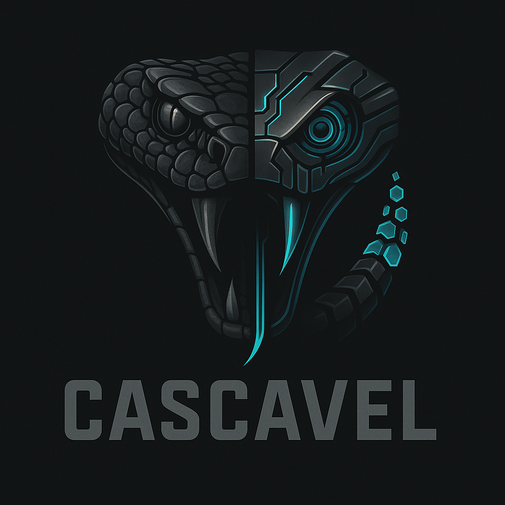

<p align="center">
  
  <br>
  
</p>

<h1 align="center">
  <code>🐍 CASCAVEL</code>
</h1>

<h3 align="center">Continuous Threat Exposure Management (CTEM) for the 2026 Enterprise</h3>

<p align="center">
<p align="center">
  <strong>The complete Red Team intelligence engine in a single binary. 108 plugins · OWASP 2026 · CVSS v4.0.</strong><br />
  Stop wrestling with fragmented security scripts. Unify your discovery, assessment, and compliance in one command.
</p>

<p align="center">
  🇺🇸 <strong>English</strong> ·
  <a href="README.pt-BR.md">🇧🇷 Português (Brasil)</a>
</p>

<p align="center">
  <a href="LICENSE"></a>
  <a href="https://www.python.org/"></a>
  
  
  <a href="https://github.com/glferreira-devsecops/Cascavel/actions/workflows/security.yml"></a>
</p>

---

## 🚀 Why Cascavel?

**The Problem:** Modern DevSecOps teams waste hundreds of hours integrating disjointed open-source tools (Nmap, Nuclei, Feroxbuster), parsing their incompatible JSON outputs, and manually compiling PDF reports for compliance. Vulnerability management is broken, fragmented, and slow.

**The Cascavel Solution:** Cascavel is a **zero-friction CTEM platform** that orchestrates 30+ industry-standard binaries and 108 bespoke security plugins into a unified, high-performance execution graph.

### Core Value Propositions:
1. **Unparalleled Orchestration:** One command triggers a multi-stage attack chain (DNS Recon ➔ Port Scan ➔ Web Crawl ➔ Exploit ➔ Report).
2. **Enterprise-Grade Reporting:** Generates heavily-stylized, legal-grade PDF reports featuring CVSS v4.0 matrices, executive summaries, and compliance mappings (ISO 27001, SOC 2, LGPD) in seconds.
3. **Hardened to the Core:** Built with paranoid 2026 security architectures—featuring AST-based payload sanitization, Path Traversal sandboxing, anti-SSRF redirect blocks, ReDoS mitigation, and supply-chain CI blocks (`zizmor` + `pip-audit`).

---

## 🎬 See it in Action

<p align="center">
  
  
</p>

<p align="center">
  <sub><strong>Left:</strong> Cinematic boot sequence and auto-detection engine. <strong>Right:</strong> Split-screen live dashboard and severity tracking.</sub>
</p>

---

## ⚡ Zero-Friction Installation

We've engineered an installation experience that respects your time. Works on macOS, Linux, WSL2, and Docker.

```bash
curl -fsSL https://raw.githubusercontent.com/glferreira-devsecops/Cascavel/main/install.sh | bash
```

**What it does automatically:** Detects OS, validates `git` & `python3`, creates a secure virtual environment, installs 108 plugins + 30 binaries, enforces SHA-256 integrity, and registers the `cascavel` global command.

---

## 💻 CLI Reference & DevSecOps Workflows

### Standard Scanning
```bash
# Full Attack Chain (Internal Plugins + External Binaries)
cascavel -t example.com

# Stealth Mode (Internal Plugins Only)
cascavel -t example.com --plugins-only

# CI/CD Friendly (Quiet + JSON Export)
cascavel -t example.com -q -o json

# Executive Presentation (PDF Report)
cascavel -t example.com --pdf
```

### ♾️ Zero-Friction CI/CD Integration
Drop this into your `.github/workflows/dast.yml` for instant, blocking security gates:

```yaml
name: "Cascavel DAST"
on: [push, pull_request]
jobs:
  scan:
    runs-on: ubuntu-latest
    steps:
      - uses: actions/checkout@v4
      - name: Install Cascavel
        run: curl -fsSL https://raw.githubusercontent.com/glferreira-devsecops/Cascavel/main/install.sh | bash
      - name: Run CTEM Pipeline
        run: cascavel -t staging.myapp.internal -q -o json
      - name: Upload Report
        uses: actions/upload-artifact@v4
        with:
          name: cascavel-results
          path: exports/*.json
```

---

## 🛡️ The 2026 Security Architecture

Cascavel doesn't just find vulnerabilities; it is highly resilient against exploitation.

| Vector | Mitigation Strategy |
|:---|:---|
| **Terminal Injection** | Strict regex filtering strips malicious CSI/OSC/DCS ANSI escape sequences from plugin output, preventing arbitrary cursor manipulations and clip-board hijacking. |
| **Argument Injection** | Employs `--` delimiters across all `subprocess.run` invocations (e.g., `notify-send`) to thwart parameter injection. |
| **Race Conditions (TOCTOU)** | Eliminates `O_TRUNC` and `O_CREAT` race conditions via low-level `os.open` system calls with `O_EXCL` flags for all output generations. |
| **Supply Chain Defense** | Enforces OSV-scanner dependency audits, Zizmor GitHub Action analysis, and pinned SHA requirements. |
| **Path Traversal Sandboxing** | All generated files are heavily sandboxed using `pathlib.resolve().is_relative_to()` to prevent arbitrary file writes via directory traversal attacks. |
| **Server-Side Request Forgery (SSRF)** | Restricts internal cloud metadata IPs (`169.254.169.254`, `100.100.100.200`) and enforces `allow_redirects=False` to prevent request hijacking. |
| **ReDoS & Log Injection (CRLF)** | Applies length capping (memory exhaustion protection) before regex evaluation and aggressively strips `\r\n` characters to prevent CWE-117. |
| **Safe Deserialization** | Strict enforcement of `yaml.safe_load` and complete ban of `pickle`, enforcing AST parsing and JSON structures only. |

---

## 🔌 Arsenal Overview (108 Plugins)

Cascavel's internal engines provide zero-false-positive detection across 12 distinct attack categories. For a full breakdown, see our [Plugin Documentation](PLUGINS.md).

* **Injection & Code Execution:** XSS, SQLi, SSTI, RCE, NoSQLi, Log4j
* **Server-Side Attacks:** SSRF, XXE, LFI, Path Traversal
* **Auth & Authorization:** JWT Analysis, OAuth flaws, CSRF, IDOR
* **Defense Bypass:** CORS misconfigurations, CSP bypass, WAF Evasion
* **Infrastructure:** Docker/K8s misconfigurations, S3 bucket enumeration, Cloud Metadata SSRF

---

## 🤝 Contributing & Security Policy

We welcome pull requests for new plugins, tools, and bug fixes!
* Review our [Contributing Guidelines](CONTRIBUTING.md) to understand our AST-based plugin architecture.
* Please read our [Security Policy](SECURITY.md) before disclosing vulnerabilities. **Cascavel is a dual-use administrative tool; we strictly forbid its use for illegal activities.**

---

<p align="center">
  <strong><code>MÉTODO CASCAVEL™</code></strong><br />
  <sub>
    A product of <a href="https://rettecnologia.org"><strong>RET Tecnologia</strong></a> — Engenharia de Software & Cibersegurança Ofensiva<br />
    <a href="https://github.com/glferreira-devsecops">Gabriel L. Ferreira</a> · Fundador & DevSecOps Lead
  </sub>
</p>
