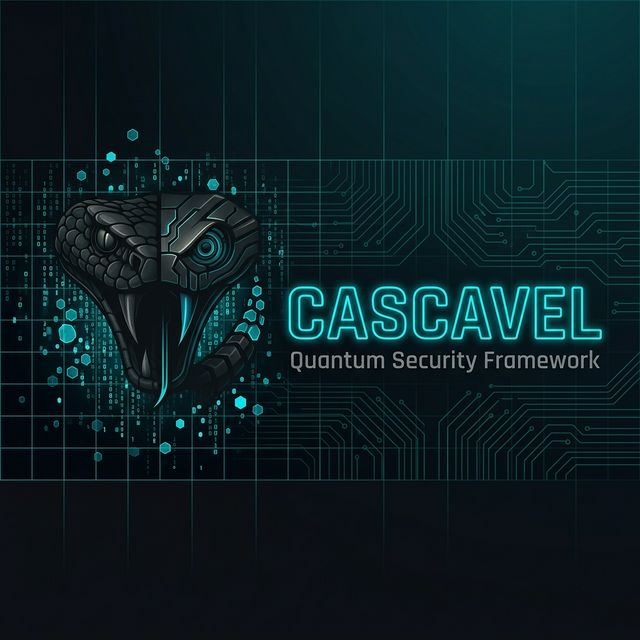
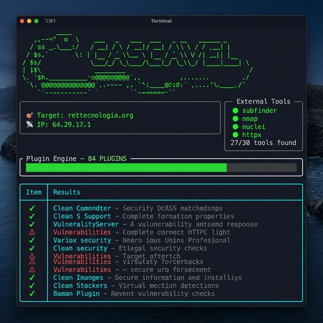
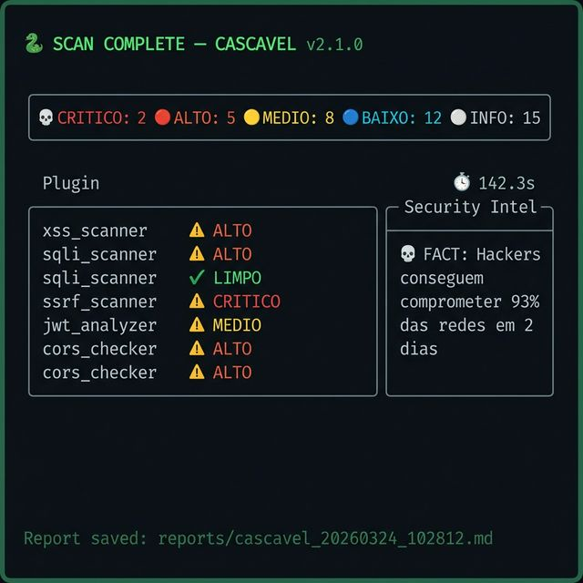

<p align="center">
  
</p>

<h1 align="center">CASCAVEL</h1>
<h3 align="center">Quantum Security Framework</h3>

<p align="center">
  <strong>Automated offensive security at industrial scale.</strong><br />
  <em>84 plugins · 30+ external tools · PDF/MD/JSON reports · Zero-config · Cross-platform</em>
</p>

<p align="center">
  <a href="LICENSE"></a>
  <a href="https://www.python.org/"></a>
  
  
  <a href="CHANGELOG.md"></a>
  
</p>

<p align="center">
  <a href="#-one-command-install">Install</a> · 
  <a href="#-live-demo">Demo</a> · 
  <a href="#-what-cascavel-does">Features</a> · 
  <a href="#-plugin-arsenal-84">Plugins</a> · 
  <a href="#-usage">CLI</a> · 
  <a href="#-pdf-reports">Reports</a> · 
  <a href="#-architecture">Architecture</a> · 
  <a href="#-contributing">Contributing</a>
</p>

<br />

> **Cascavel** (Portuguese for *rattlesnake*) is a Red Team automation framework built by [**RET Tecnologia**](https://rettecnologia.org). It orchestrates 84 security plugins and 30+ external tools into a single pipeline that scans, attacks, analyzes, and delivers professional PDF reports — all from one command.

<br />

---

## 🎬 Live Demo

<p align="center">
  
</p>
<p align="center"><sub>▲ Target acquisition · external tools detection (27/30) · 84-plugin engine executing against live target</sub></p>

<br />

<p align="center">
  
</p>
<p align="center"><sub>▲ Real-time severity dashboard · Security Intel breakdown · auto-generated PDF/Markdown reports</sub></p>

---

## ⚡ One-Command Install

```bash
curl -fsSL https://raw.githubusercontent.com/glferreira-devsecops/Cascavel/main/install.sh | bash
```

> ⚙️ **Detects your OS** (macOS · Ubuntu · Debian · Kali · Parrot · Fedora · RHEL · CentOS · Arch · Manjaro · Alpine · SUSE · Windows WSL), installs Python 3.8+, creates virtualenv, installs pip dependencies, downloads Go tools (subfinder, httpx, nuclei, katana, naabu, dnsx...), Rust tools (feroxbuster), and configures everything. Just paste and wait.

<details>
<summary><strong>💻 Manual installation</strong></summary>

```bash
git clone https://github.com/glferreira-devsecops/Cascavel.git
cd Cascavel
python3 -m venv venv && source venv/bin/activate  # Windows: venv\Scripts\activate
pip install -r requirements.txt
python3 cascavel.py -t target.com
```
</details>

---

## 🐍 What Cascavel Does

Most security tools are **single-purpose** — Nmap scans ports, Nuclei finds CVEs, SQLMap tests SQLi. You juggle 20+ tools, merge outputs by hand, and format reports manually.

**Cascavel replaces that entire workflow.**

```
                   ┌─── subfinder · amass · dnsx ───┐
                   │                                  │
  TARGET ──▶ ──▶   ├─── nmap · naabu · httpx  ───────┤
                   │                                  │
  1 command        ├─── nuclei · nikto · sqlmap ──────┤ ──▶  PDF REPORT
                   │                                  │      (12 legal disclaimers)
                   ├─── 84 custom plugins ────────────┤      (CVSS scoring)
                   │                                  │      (compliance mapping)
                   └─── katana · feroxbuster · gau ───┘
```

### The pipeline

| Phase | What happens | Tools |
|:---:|---|---|
| **🔍 Discover** | Subdomains, DNS, WHOIS/RDAP, cloud providers, surface area | subfinder, amass, dnsx, whois |
| **📡 Probe** | Ports, banners, HTTP headers, TLS certificates, tech stack | nmap, naabu, httpx, wappalyzer |
| **💉 Attack** | XSS, SQLi, SSRF, LFI, RCE, SSTI, XXE, NoSQL, prototype pollution | 84 plugins + sqlmap + nuclei |
| **🔐 Analyze** | JWT, OAuth, CORS, CSP, CSRF, session fixation, IDOR, race conditions | Custom analysis engine |
| **🏗️ Detect** | Exposed Docker/K8s/Redis/MongoDB, CI/CD leaks, cloud metadata, S3 | Infrastructure plugins |
| **📄 Report** | Professional PDF with CVSS scores, compliance mapping, legal disclaimers | reportlab Platypus engine |

---

## 📄 PDF Reports

Cascavel generates **enterprise-grade PDF reports** signed by RET Tecnologia with:

- **Cover page** with logo, target metadata, report ID, classification level
- **12 legal disclaimers** — Confidentiality/NDA, Scope/SOW, Authorization (LGPD, Marco Civil, Art. 154-A, Bill 4752/2025), Liability Limitation, No Warranties, Client Remediation Responsibility, Inherent Risks, Regulatory Compliance, Data Protection (LGPD Art. 48), Evidence Retention (NIST SP 800-88), Intellectual Property, Final Legal Notice
- **Executive summary** with dynamic posture badge (5 severity levels)
- **CVSS v4.0 severity breakdown** with color-coded table
- **Visual risk matrix** (bar chart)
- **Detailed findings** with OWASP Top 10 mapping, evidence, remediation
- **Compliance mapping** — 9 frameworks (OWASP, CVSS, NIST, ISO 27001/27005, PCI DSS, LGPD, Marco Civil, PTES)
- **5-phase PTES methodology** documentation
- **Signature page** with SHA-256 integrity hash

```bash
# Generate PDF report
python3 cascavel.py -t target.com --pdf

# Or with output format flag
python3 cascavel.py -t target.com -o pdf
```

---

## 🔌 Plugin Arsenal (84)

Every plugin follows a standardized interface, returns structured output, and operates with **zero false positive** tolerance.

<table>
<tr><td>

### 💉 Injection & Code Execution (7)
`xss_scanner` · `sqli_scanner` · `ssti_scanner` · `rce_scanner` · `blind_rce` · `nosql_scanner` · `cve_2021_44228_scanner`

### 🌐 Server-Side (4)
`ssrf_scanner` · `xxe_scanner` · `lfi_scanner` · `path_traversal`

### 🔐 Auth & AuthZ (6)
`jwt_analyzer` · `oauth_scanner` · `csrf_detector` · `idor_scanner` · `session_fixation` · `password_policy`

### 🔄 Protocol (4)
`http_smuggling` · `http2_smuggle` · `websocket_scanner` · `grpc_scanner`

### 🛡️ Defense Bypass (7)
`cors_checker` · `csp_bypass` · `clickjacking_check` · `host_header_injection` · `web_cache_poison` · `rate_limit_check` · `waf_bypass`

### 🎯 API Security (4)
`graphql_probe` · `graphql_injection` · `api_enum` · `api_versioning`

### 💣 Advanced Web (6)
`mass_assignment` · `race_condition` · `prototype_pollution` · `deserialization_scan` · `open_redirect` · `crlf_scanner`

</td><td>

### 🏗️ Infrastructure (8)
`docker_exposure` · `k8s_exposure` · `redis_unauth` · `mongodb_unauth` · `elastic_exposure` · `cicd_exposure` · `cloud_metadata` · `cloud_enum`

### 🔍 Recon & OSINT (11)
`subdomain_hunter` · `subdomain_takeou` · `dns_deep` · `dns_rebinding` · `network_mapper` · `email_harvester` · `email_spoof_check` · `shodan_recon` · `wayback_enum` · `whois_recon` · `traceroute_mapper`

### 🕵️ Info Gathering (7)
`tech_fingerprint` · `js_analyzer` · `param_miner` · `info_disclosure` · `secrets_scraper` · `git_dumper` · `admin_finder`

### 🌐 Web Scanning (7)
`dir_bruteforce` · `nikto_scanner` · `katana_crawler` · `http_methods` · `wps_scanmini` · `nuclei_scanner` · `fast_webshell`

### ☁️ Cloud (2)
`s3_bucket` · `saml_scanner`

### 📊 Analysis (5)
`ssl_check` · `waf_detec` · `profiler_bundpent` · `nmap_advanc` · `auto_exploit`

### 🔐 Brute Force (6)
`ssh_brute` · `ftp_brute` · `smb_ad` · `smpt_enum` · `heartbleed_scanner` · `domain_transf`

</td></tr>
</table>

> 📖 **Full documentation**: [PLUGINS.md](PLUGINS.md) — techniques, bypass research, and dependencies for each plugin.

---

## 💡 Usage

```bash
# Full auto-scan
python3 cascavel.py -t example.com

# Interactive mode (prompts for target)
python3 cascavel.py

# Plugins-only (skip external tools)
python3 cascavel.py -t example.com --plugins-only

# PDF report
python3 cascavel.py -t example.com --pdf

# JSON output (CI/CD pipelines)
python3 cascavel.py -t example.com -q -o json

# Custom timeout
python3 cascavel.py -t example.com --timeout 120

# List all plugins
python3 cascavel.py --list-plugins

# Check installed tools
python3 cascavel.py --check-tools
```

### CLI Reference

| Flag | Description |
|:---|:---|
| `-t`, `--target` | Target IP or domain |
| `-q`, `--quiet` | Suppress preloader and animations |
| `-o`, `--output-format` | Report format: `md` / `json` / `pdf` |
| `--pdf` | Shorthand for `-o pdf` |
| `--timeout` | Global timeout in seconds (default: 90) |
| `--plugins-only` | Run only internal plugins |
| `--check-tools` | Show which external tools are installed |
| `--list-plugins` | List all 84 plugins |
| `--no-preloader` | Skip cinematic boot animation |
| `--no-notify` | Disable desktop notification |
| `-v`, `--version` | Show version |

---

## 🛠️ External Tools (30+)

All optional — Cascavel gracefully skips any tool not in `$PATH`.

| Category | Tools |
|:---|:---|
| **Reconnaissance** | subfinder · amass · dnsx · fierce · dnsrecon · whois |
| **Web Scanning** | httpx · nikto · katana · feroxbuster · ffuf · gobuster |
| **Port Scanning** | nmap · naabu |
| **Vulnerability** | nuclei · sqlmap |
| **OSINT** | shodan · gau · waybackurls · asnmap · mapcidr |
| **WAF Detection** | wafw00f |
| **Network** | traceroute · dig · tshark |
| **Crypto** | sslscan |
| **CMS** | wpscan · whatweb |
| **Brute Force** | hydra · john |

<details>
<summary><strong>📦 macOS (Homebrew)</strong></summary>

```bash
brew install nmap nikto sqlmap feroxbuster hydra john-jumbo wafw00f dnsrecon fierce tshark whois
```
</details>

<details>
<summary><strong>📦 Linux (Debian/Ubuntu/Kali)</strong></summary>

```bash
sudo apt install nmap nikto sqlmap hydra john sslscan dnsrecon fierce tshark whois traceroute
cargo install feroxbuster
pip install wafw00f
```
</details>

<details>
<summary><strong>📦 Go-based tools (ProjectDiscovery)</strong></summary>

```bash
go install -v github.com/projectdiscovery/subfinder/v2/cmd/subfinder@latest
go install -v github.com/projectdiscovery/httpx/cmd/httpx@latest
go install -v github.com/projectdiscovery/naabu/v2/cmd/naabu@latest
go install -v github.com/projectdiscovery/nuclei/v3/cmd/nuclei@latest
go install -v github.com/projectdiscovery/katana/cmd/katana@latest
go install -v github.com/projectdiscovery/dnsx/cmd/dnsx@latest
go install -v github.com/projectdiscovery/asnmap/cmd/asnmap@latest
go install -v github.com/projectdiscovery/mapcidr/cmd/mapcidr@latest
go install -v github.com/owasp-amass/amass/v3/...@master
go install -v github.com/ffuf/ffuf@latest
go install -v github.com/OJ/gobuster/v3@latest
go install -v github.com/lc/gau/v2/cmd/gau@latest
go install -v github.com/tomnomnom/waybackurls@latest
```
</details>

> 💡 Or just run `install.sh` — it handles everything automatically.

---

## 🏗️ Architecture

```
┌──────────────────────────────────────────────────────────────┐
│                     CASCAVEL ENGINE v2.1.0                    │
│                                                               │
│  ┌───────────┐  ┌────────────┐  ┌───────────┐  ┌──────────┐ │
│  │ CLI       │  │ Preloader  │  │ Target    │  │ Report   │ │
│  │ Parser    │  │ (Awwwards) │  │ Resolver  │  │ Engine   │ │
│  └─────┬─────┘  └────────────┘  └─────┬─────┘  └────┬─────┘ │
│        │                               │              │       │
│  ┌─────▼───────────────────────────────▼──────────────┘     │
│  │                                                           │
│  │          EXTERNAL TOOLS PIPELINE (30+ tools)              │
│  │   subfinder · nmap · nuclei · katana · gau · nikto       │
│  │   ffuf · gobuster · feroxbuster · wafw00f · dnsx         │
│  │   whois · traceroute · dig · amass · httpx · naabu       │
│  │                                                           │
│  └──────────────────────┬────────────────────────────────────┘
│                         │                                     │
│  ┌──────────────────────▼────────────────────────────────┐   │
│  │                                                        │   │
│  │              PLUGIN ENGINE (84 plugins)                 │   │
│  │     Auto-discovery · Standardized interface             │   │
│  │     Parallel execution · Severity classification        │   │
│  │                                                        │   │
│  │  Injection(7) · ServerSide(4) · Auth(6) · Protocol(4) │   │
│  │  Defense(7) · API(4) · WebAttack(6) · Infra(8)        │   │
│  │  Recon(11) · InfoGather(7) · WebScan(7) · Cloud(2)    │   │
│  │  Analysis(5) · BruteForce(6)                          │   │
│  │                                                        │   │
│  └──────────────────────┬────────────────────────────────┘   │
│                         │                                     │
│  ┌──────────────────────▼────────────────────────────────┐   │
│  │                                                        │   │
│  │        REPORT GENERATOR (reportlab Platypus)           │   │
│  │   PDF · Markdown · JSON                                │   │
│  │   CVSS v4.0 · OWASP mapping · 12 disclaimers          │   │
│  │   Risk matrix · Compliance mapping · Signatures        │   │
│  │                                                        │   │
│  └────────────────────────────────────────────────────────┘   │
└──────────────────────────────────────────────────────────────┘
```

### Project Structure

```
Cascavel/
├── cascavel.py              # Core engine — CLI, pipeline, plugin runner
├── report_generator.py      # PDF report generator (Platypus + RET branding)
├── install.sh               # Universal one-command installer (7+ OSes)
├── cascavel_logo.png        # Framework logo
├── plugins/                 # 84 security plugins
│   ├── __init__.py
│   ├── xss_scanner.py       # XSS — polyglot, DOM, mutation
│   ├── sqli_scanner.py      # SQLi — time/error/union-based
│   ├── ssrf_scanner.py      # SSRF — IMDSv2, DNS rebinding, gopher
│   ├── jwt_analyzer.py      # JWT — none-alg, key confusion, JWKS
│   └── ...                  # 80 more plugins
├── docs/                    # Screenshots & visual assets
├── wordlists/               # Auto-downloaded fuzzing wordlists
├── nuclei-templates/        # Nuclei vulnerability templates
├── exports/                 # External tool raw outputs
├── reports/                 # Generated scan reports (PDF/MD/JSON)
├── requirements.txt         # Python dependencies
├── pyproject.toml           # Build configuration
├── PLUGINS.md               # Full plugin documentation
├── CONTRIBUTING.md          # Contribution guide
├── CHANGELOG.md             # Version history
├── SECURITY.md              # Vulnerability disclosure policy
├── CODE_OF_CONDUCT.md       # Community guidelines
└── LICENSE                  # MIT License
```

---

## 🤝 Contributing

Contributions welcome. See [CONTRIBUTING.md](CONTRIBUTING.md) for the full guide.

**Plugin interface:**

```python
def run(target: str, ip: str, open_ports: list, banners: dict) -> dict:
    """One-sentence description of what this plugin does."""
    results = {}
    # Your security logic here
    return {"plugin": "my_plugin", "resultados": results}
```

Create your file in `plugins/`, restart Cascavel — it auto-discovers new plugins.

---

## 📋 Changelog

See [CHANGELOG.md](CHANGELOG.md).

## 🔒 Security

Found a vulnerability? See [SECURITY.md](SECURITY.md) for responsible disclosure.

## 📄 License

[MIT](LICENSE) — use it, fork it, break things, fix things.

---

<p align="center">
  <strong>MÉTODO CASCAVEL™</strong><br />
  <sub>Built by <a href="https://rettecnologia.org"><strong>RET Tecnologia</strong></a> — Engenharia de Software & Cibersegurança Ofensiva</sub><br />
  <sub><a href="https://github.com/glferreira-devsecops">Gabriel L. Ferreira</a> · Fundador & DevSecOps Lead</sub>
</p>

<p align="center">
  <sub>Making the web safer, one target at a time. 🐍</sub>
</p>